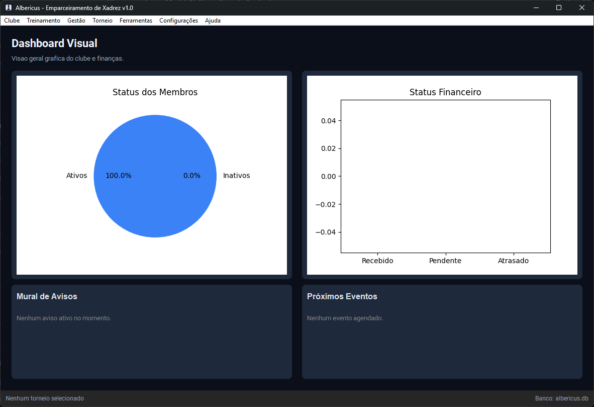
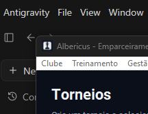
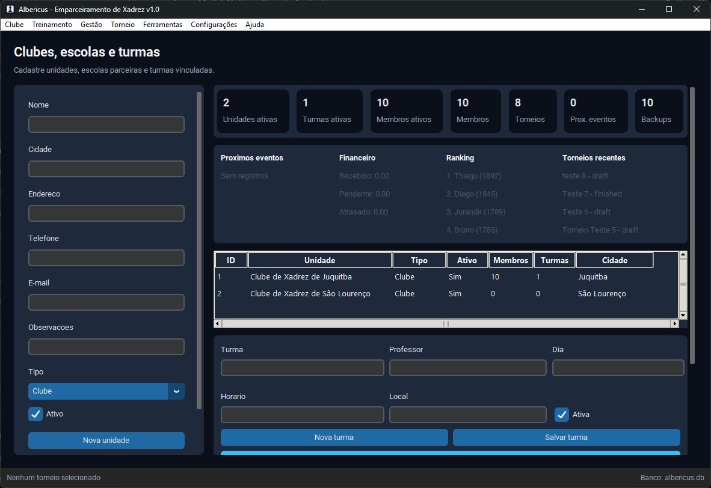
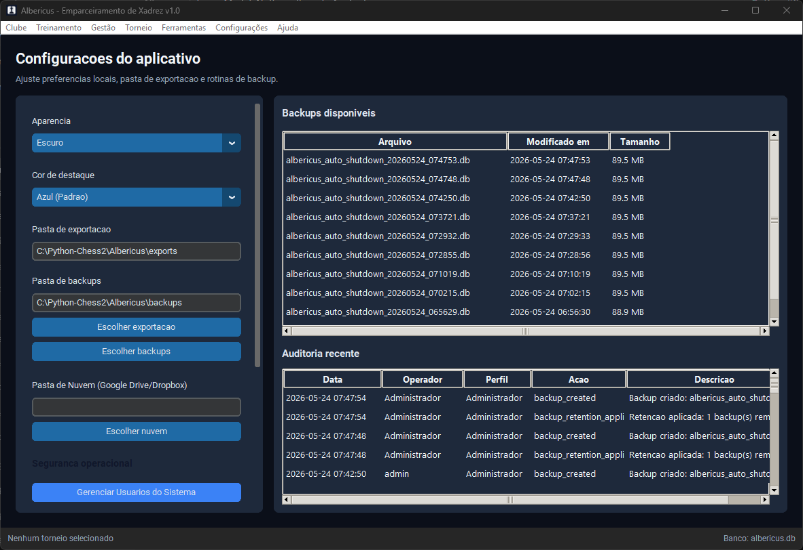

# Manual do Usuário Completo: Albericus v1.0

Bem-vindo ao **Albericus**, o sistema definitivo de arquitetura robusta para Gerenciamento de Clubes de Xadrez, Escolas e Arbitragem de Torneios. Este manual detalha minuciosamente todas as operações, módulos e fluxos de trabalho presentes na versão 1.0.

---

## Índice
1. [Iniciando o Sistema](#1-iniciando-o-sistema)
2. [Painel Central (Dashboard)](#2-painel-central-dashboard)
3. [Módulo de Torneios e Arbitragem](#3-módulo-de-torneios-e-arbitragem)
4. [Gestão do Clube e Escola](#4-gestão-do-clube-e-escola)
5. [Configurações e Integrações](#5-configurações-e-integrações)

---

## 1. Iniciando o Sistema
O Albericus foi desenhado para rodar localmente com alta segurança.
- Para rodar a versão portátil, basta executar o arquivo `Albericus.exe` presente na pasta `dist/`.
- Ao iniciar, você será direcionado para o Menu Lateral esquerdo, onde toda a navegação principal ocorre.
- Se o controle de acesso estiver ativo, use a senha definida pelo administrador chefe (senha padrão costuma ser `admin` ou `admin123`).

---

## 2. Painel Central (Dashboard)
A tela de Dashboard é o seu centro de comando.

### 2.1 Métricas Principais
No topo, você encontra quadros resumindo o desempenho em tempo real do seu clube:
- **Jogadores:** Quantos membros ativos o clube tem.
- **Torneios:** O total de torneios registrados (finalizados, em andamento e previstos).
- **Caixa:** O saldo líquido atual da gestão financeira.
- **Relógios:** O total de relógios de xadrez em estoque.

### 2.2 Gráficos de Crescimento
A parte central exibe gráficos analíticos gerados automaticamente:
- **Membros Ativos:** Um histórico para acompanhar o crescimento do seu clube de xadrez mês a mês.
- **Frequência em Torneios:** Um mapa visual que ajuda a entender quais formatos ou meses atraem mais jogadores.

---

## 3. Módulo de Torneios e Arbitragem
O motor de Torneios do Albericus suporta cálculos de força FIDE e CBX de maneira automatizada.

### 3.1 Criando um Torneio
1. Vá na aba **Torneios** e clique em "Criar Novo Torneio".
2. Selecione o **Sistema de Disputa**:
   - **Suíço:** Para torneios com muitos jogadores e poucas rodadas.
   - **Schuring (Round-Robin):** Todos jogam contra todos (todos-contra-todos).
3. Defina o número de rodadas, tempo de reflexão (ritmo) e datas.

### 3.2 Inscrição Rápida de Jogadores
- Clique em "Adicionar Jogador".
- **O Segredo:** Se o jogador já tem registro oficial, basta digitar o **ID FIDE** ou **ID CBX** no formulário e apertar a tecla "Tab" (ou clicar fora da caixa). O Albericus preencherá instantaneamente o Nome, Sobrenome, Titulação, Sexo, Idade (Nascimento) e Ratings Standard/Rapid/Blitz.
- Também é possível buscar pelo nome se você já sincronizou os bancos de dados oficias nas configurações.

### 3.3 Rodadas e Emparceiramento (Pairing)
1. Inicie a Rodada 1. O motor matemático fará o sorteio balanceado das cores (Brancas e Pretas) usando regras estritas.
2. Na aba lateral do torneio, insira os resultados de cada mesa:
   - `1 - 0` (Vitória Brancas)
   - `0 - 1` (Vitória Pretas)
   - `1/2 - 1/2` (Empate)
   - Adicione também W.O, Byes e ausências.
3. Clique em "Encerrar Rodada e Sortear Próxima".

### 3.4 Classificação e Exportação
O sistema calcula a tabela cruzada com critérios de desempate avançados (Sonneborn-Berger, Buchholz, Milésimos).
No fim, clique em **Exportar**. O Albericus pode gerar:
- `Chess-Results (TRF16)`: arquivo texto compatível com o fluxo FIDE/Swiss-Manager/Chess-Results, incluindo dados do torneio, jogadores, equipes quando houver e resultados por rodada.
- `PGN (Partidas)`: arquivo de partidas/resultados para consulta, arquivo técnico ou publicação complementar.
- `PDF`, `XLSX` e `CSV`: relatórios bonitos para impressão, conferência e prestação de contas.

Antes de gerar o TRF16, revise nome do torneio, local, federação, árbitro-chefe, ritmo, datas das rodadas, FIDE ID, rating, federação e nascimento dos jogadores. Se algum dado oficial estiver faltando, o Albericus exporta o arquivo e mostra avisos para correção.

---

## 4. Gestão do Clube e Escola
A parte administrativa evita o uso de milhares de planilhas desorganizadas do Excel.

### 4.1 Membros e Controle de Turmas
- O painel exibe todos os associados em formato de tabela.
- Você pode criar "Turmas" de aprendizado (ex: Turma Iniciante - Sábados) e vincular membros.
- Use a **Gestão de Aprendizado** para acompanhar o nível de cada aluno, registrar treinos táticos feitos e avaliações.

### 4.2 Biblioteca Mágica
- Permite o empréstimo de livros físicos de xadrez para os alunos.
- Basta cadastrar o acervo de livros. Quando um livro for emprestado, o sistema gravará o dia da devolução.
- Linhas vermelhas aparecerão se o aluno estiver em atraso.

### 4.3 Caixa Financeiro Integrado
- Um livro-caixa dentro do programa.
- **Entradas:** Registre o pagamento de mensalidades, vendas de apostilas, patrocínios, etc.
- **Saídas:** Pagamento de aluguel, premiação de torneios ou conserto de tabuleiros.
- Você pode gerar um PDF no final do mês para prestar contas aos diretores do clube.

### 4.4 Inventário (Estoque)
- Controle a quantidade de Relógios Digitais, Relógios Analógicos, Peças oficiais e Tabuleiros Courvin.
- Evite perdas ou furtos, registrando manutenções ("2 relógios em conserto de mola").

---

## 5. Configurações e Integrações
O Albericus brilha na automação de tarefas tediosas do árbitro ou diretor.

### 5.1 Importação Real-time da CBX e FIDE
1. Vá em **Configurações > Sincronização e Rating Oficial**.
2. **FIDE:** Clique em "Sincronizar Lista da FIDE". O robô entrará no site da Federação Internacional, baixará os arquivos XML ZIP globais no plano de fundo e atualizará milhões de jogadores na sua máquina.
3. **CBX:** A CBX exige senha de diretor no site deles. Acesse o sistema da CBX, baixe a lista do Excel em `.xls`, `.xlsx` ou `.csv` e no Albericus, clique em "Importar Lista CBX". O arquivo de tabela será completamente varrido e indexado ao banco local.
4. **Vantagem:** Sempre que você for inscrever um jogador, todas as forças FIDE/CBX reais estarão no auto-completar!

### 5.2 Nuvem, Backups e Segurança
- Em "Banco de Dados e Backup", é altamente recomendado agendar cópias de segurança.
- O botão **Backup Imediato** cria um pacote zip seguro em 1 segundo. Se o computador principal queimar durante o torneio, basta jogar o backup em outro PC com Albericus, e clicar em **Restaurar**. Nenhuma rodada será perdida.

### 5.3 Comunicações e Disparos
- **E-mail:** O Albericus permite configurar SMTP para envio real quando o clube possui servidor de e-mail.
- **WhatsApp e outras APIs externas:** ficam reservados para integração futura. Até lá, use os relatórios, listas e portais HTML exportados para comunicação manual ou publicação local.
- Durante inscrições, eventos e torneios, mantenha e-mails e telefones atualizados para facilitar comunicados e conferências.

### 5.4 Personalização Visual
- Você prefere conforto para os olhos num torneio longo noturno? Vá em Aparência e troque para **Tema Escuro (Dark Mode)**, e mude o Tema de Destaque para sua cor favorita (Azul, Verde Claro, Vermelho FIDE).

---

> [!NOTE]
> ### Dica de Mestre Final
> Nunca deixe de cadastrar os e-mails e CPFs/IDs corretamente. Um banco de dados bem polido no Albericus significa que o sorteio suíço será preciso com a força correta, os desempates serão justos, e os relatórios financeiros do final do ano baterão no centavo. Boa organização e bons jogos!
