# Manual Completo do Albericus

Gerado em 07/06/2026.

Este manual documenta os menus, telas, funcoes principais, fluxos recomendados e cuidados operacionais do Albericus.

## Sumario

- [Fluxo recomendado](#fluxo-recomendado)
- [Mapa dos menus](#mapa-dos-menus)
- [Telas e funcoes](#telas-e-funcoes)
- [Regras importantes](#regras-importantes)
- [Problemas comuns](#problemas-comuns)

## Fluxo recomendado

1. Cadastre o clube, escola ou projeto em **Clube > Perfil do Clube**.
2. Cadastre turmas, niveis, membros e responsaveis.
3. Configure pastas e backups em **Configuracoes > Config. App**.
4. Crie ou importe um torneio em **Torneio > Torneios**.
5. Revise **Config. Torneio** antes da primeira rodada.
6. Inscreva jogadores e atualize dados oficiais.
7. Gere rodadas, lance resultados, acompanhe o **Painel do Arbitro** e feche cada rodada.
8. Confira a classificacao, exporte arquivos e gere diplomas/relatorios.

## Mapa dos menus

| Menu | Acao | Atalho | Abre/Executa |
|---|---|---|---|
| Clube | Dashboard Visual | Ctrl+1 | Dashboard Visual |
| Clube | Perfil do Clube | - | Perfil do Clube |
| Clube | Membros | - | Membros |
| Clube | Niveis | - | Niveis de Aprendizagem |
| Clube | Responsaveis | - | Responsaveis |
| Treinamento | Aulas | - | Aulas e Presencas |
| Treinamento | Exercicios | - | Exercicios e Listas |
| Gestao | Arbitros | - | Arbitros |
| Gestao | Inventario | - | Inventario |
| Gestao | Financeiro | - | Financeiro |
| Gestao | Calendario | - | Calendario |
| Gestao | Ranking Interno | - | Ranking Interno |
| Torneio | Torneios | Ctrl+2 | Torneios |
| Torneio | Central do Torneio | Ctrl+3 | Central do Torneio |
| Torneio | Painel do Arbitro | - | Painel do Arbitro |
| Torneio | Config. Torneio | - | Configuracao do Torneio |
| Torneio | Jogadores | - | Jogadores |
| Torneio | Equipes | - | Equipes |
| Torneio | Rodadas | Ctrl+4 | Rodadas e Resultados |
| Torneio | Classificacao | Ctrl+5 | Classificacao |
| Torneio | Diplomas | - | Diplomas |
| Ferramentas | Exportar | - | Exportar |
| Ferramentas | Relatorios Administrativos | - | Relatorios Administrativos |
| Ferramentas | DRE Financeiro | - | DRE Financeiro |
| Ferramentas | Comunicacao | - | Comunicacao |
| Ferramentas | Integracoes Operacionais | - | Integracoes Operacionais |
| Configuracoes | Config. App | Ctrl+, | Configuracoes do Aplicativo |
| Configuracoes | Auditoria Completa | - | Auditoria Completa |
| Ajuda | Buscar acao... | Ctrl+K | Palette de Comandos |
| Ajuda | Apoie o Projeto | - | Janela de apoio/PIX |
| Ctrl+K | Biblioteca Pedagogica | - | Biblioteca Pedagogica |
| Global | Recarregar tela | F5 | Reexecuta a tela atual |

## Telas e funcoes

### Tela de Login

**Caminho:** Inicial > Acesso Restrito

Primeira tela exibida na abertura do Albericus quando o controle de acesso esta ativo.

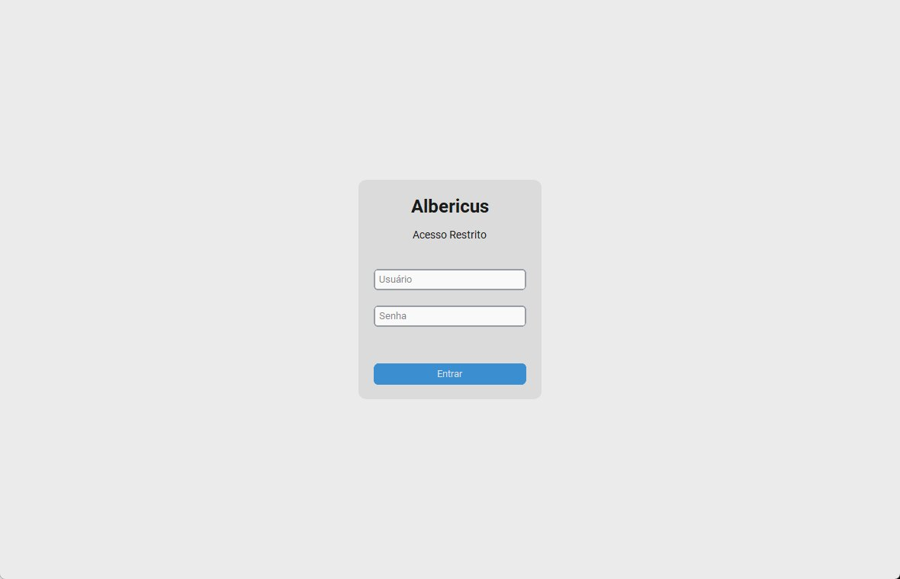

**Principais funcoes:**
- Informa usuario e senha do operador.
- Bloqueia a navegacao ate uma autenticacao valida.
- Permite entrar pela tecla Enter depois de preencher a senha.
- Exibe aviso de campos obrigatorios ou credenciais invalidas.

**Fluxo recomendado:**
1. Digite o usuario.
2. Digite a senha.
3. Clique em Entrar ou pressione Enter.

**Cuidados:**
- Operadores e permissoes sao administrados em Configuracoes do Aplicativo > Seguranca e dados.

### Dashboard Visual

**Caminho:** Clube > Dashboard Visual

Painel grafico de abertura para acompanhar situacao do clube, membros, caixa e agenda.

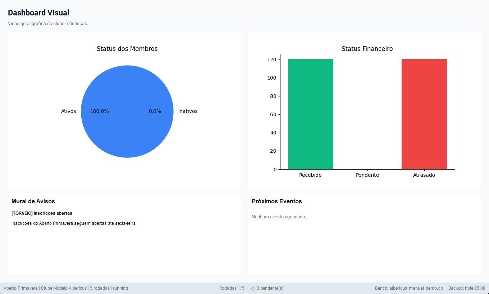

**Principais funcoes:**
- Mostra grafico de status dos membros.
- Mostra grafico financeiro com recebido, pendente e atrasado.
- Exibe mural de avisos ativos.
- Lista proximos eventos cadastrados no calendario.

**Fluxo recomendado:**
1. Use como tela inicial de acompanhamento.
2. Abra os modulos de detalhe quando algum indicador exigir acao.

### Perfil do Clube, Escola ou Projeto

**Caminho:** Clube > Perfil do Clube

Cadastro das unidades que organizam membros, turmas, aulas, torneios e relatorios.

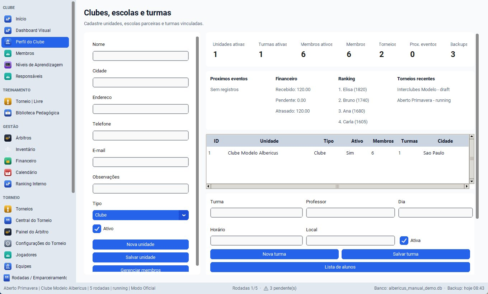

**Principais funcoes:**
- Cria e edita clubes, escolas, projetos e parceiros.
- Mantem dados de contato, endereco, cidade e observacoes.
- Cadastra turmas vinculadas a uma unidade.
- Carrega indicadores operacionais da unidade selecionada.

**Fluxo recomendado:**
1. Cadastre a unidade principal.
2. Salve as turmas usadas em aulas e torneios.
3. Selecione uma unidade para editar ou revisar dados.

**Cuidados:**
- Comece por esta tela antes de montar rotinas de clube, treinamento ou torneios integrados.

### Membros

**Caminho:** Clube > Membros

Cadastro central de alunos, socios, visitantes e convidados.

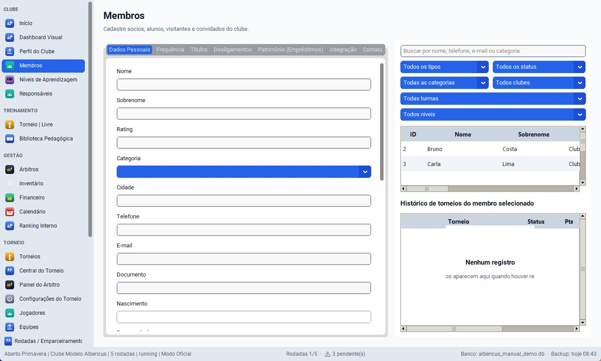

**Principais funcoes:**
- Registra nome, sobrenome, rating, categoria, documentos, contatos e nascimento.
- Associa o membro a clube, turma e nivel pedagogico.
- Filtra por texto, clube, turma, tipo, status e categoria.
- Mostra historico esportivo, financeiro, presencas e variacao de rating do membro selecionado.

**Fluxo recomendado:**
1. Cadastre membros ativos.
2. Associe turma e nivel quando aplicavel.
3. Use o historico para conferir pendencias ou participacoes.

**Cuidados:**
- Membros ativos podem ser inscritos automaticamente em torneios de clube ou turma.

### Niveis de Aprendizagem

**Caminho:** Clube > Niveis

Estrutura pedagogica usada para organizar alunos, aulas, exercicios e listas de treino.

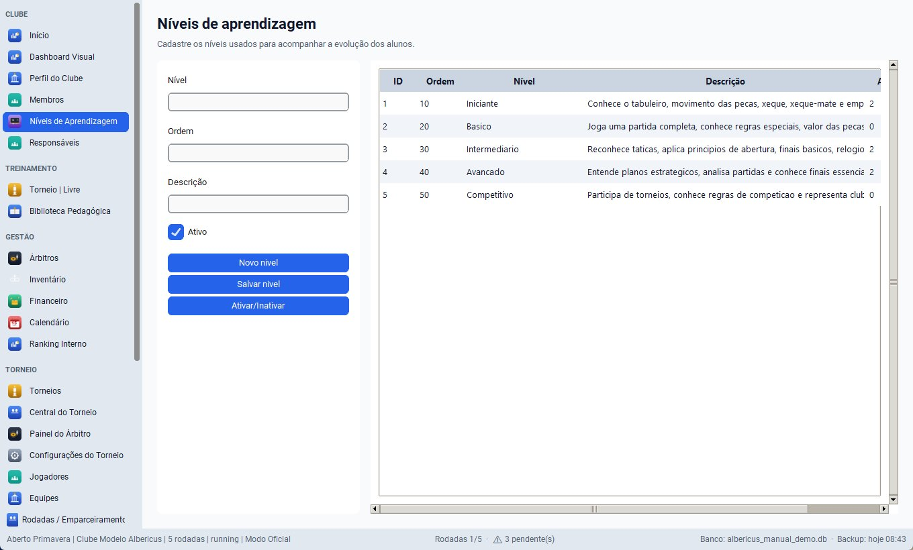

**Principais funcoes:**
- Cria niveis como Iniciante, Intermediario e Avancado.
- Define descricao e ordem de exibicao.
- Ativa ou inativa niveis sem apagar historico.
- Mostra quantos membros estao vinculados a cada nivel.

**Fluxo recomendado:**
1. Crie os niveis do metodo de ensino.
2. Aplique o nivel em membros e exercicios.
3. Mantenha a ordem para leitura rapida nos filtros.

### Responsaveis

**Caminho:** Clube > Responsaveis

Controle de contatos de pais, responsaveis legais e contatos de emergencia.

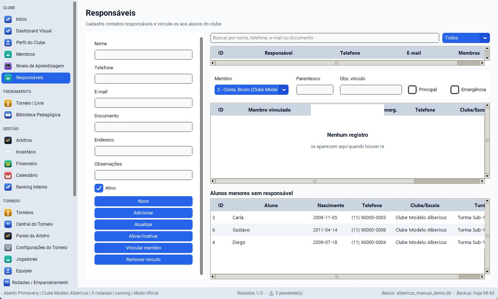

**Principais funcoes:**
- Cadastra responsavel com telefone, e-mail, documento, endereco e observacoes.
- Vincula responsavel a um ou mais membros.
- Marca contato principal e contato de emergencia.
- Lista menores sem responsavel para correcao cadastral.

**Fluxo recomendado:**
1. Cadastre o responsavel.
2. Selecione o aluno.
3. Informe parentesco e marque contato principal/emergencia quando necessario.

### Aulas e Presencas

**Caminho:** Treinamento > Aulas

Agenda aulas, treinos e chamadas vinculadas ao clube, turma e lista de exercicios.

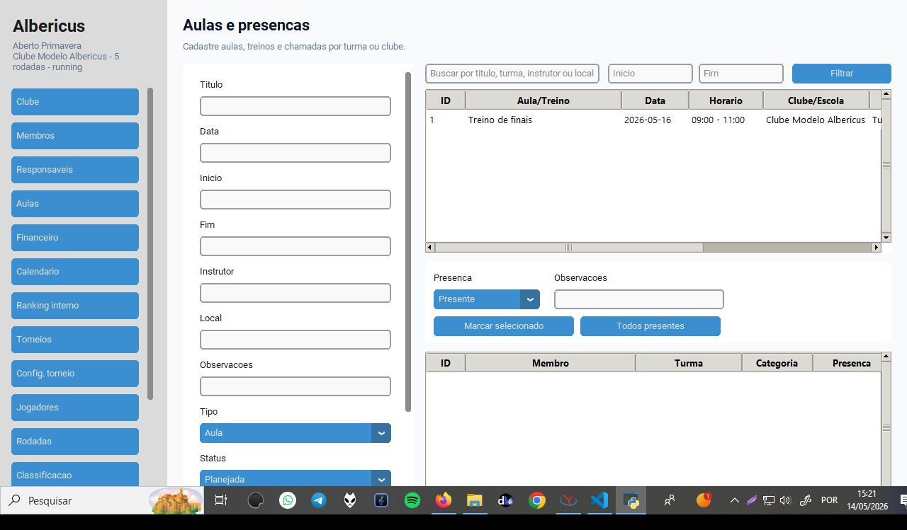

**Principais funcoes:**
- Registra titulo, tipo, data, horario, instrutor, local, objetivo e conteudo.
- Vincula aula a clube, turma, nivel e lista de treino.
- Carrega chamada dos membros da turma.
- Salva presencas como presente, ausente ou justificada.

**Fluxo recomendado:**
1. Cadastre a aula.
2. Selecione a sessao criada.
3. Marque a chamada e salve.
4. Use os dados em relatorios de presenca.

**Cuidados:**
- Datas usam formato AAAA-MM-DD.

### Exercicios e Listas

**Caminho:** Treinamento > Exercicios

Biblioteca tatica operacional para aulas, listas de treino e acompanhamento pedagogico.

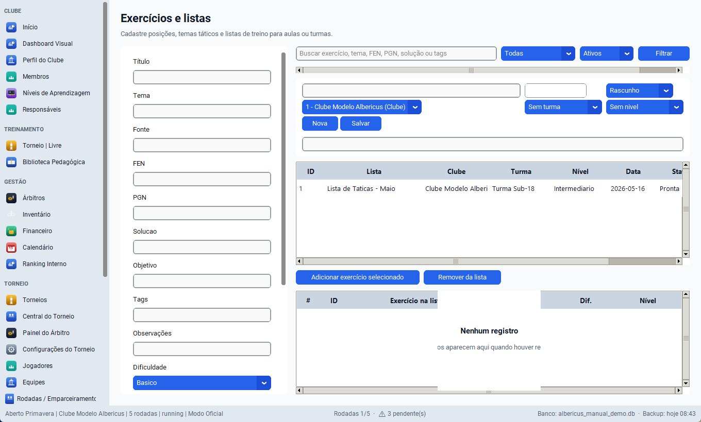

**Principais funcoes:**
- Cadastra exercicio com tema, FEN, PGN, solucao, objetivo, dificuldade e tags.
- Filtra exercicios por busca, dificuldade e status.
- Cria listas de treino por clube, turma, nivel e data alvo.
- Adiciona ou remove exercicios da lista selecionada.

**Fluxo recomendado:**
1. Cadastre exercicios reutilizaveis.
2. Crie uma lista para a turma.
3. Adicione exercicios selecionados.
4. Vincule a lista a uma aula.

### Arbitros

**Caminho:** Gestao > Arbitros

Cadastro da equipe de arbitragem, usado em torneios e relatorios oficiais.

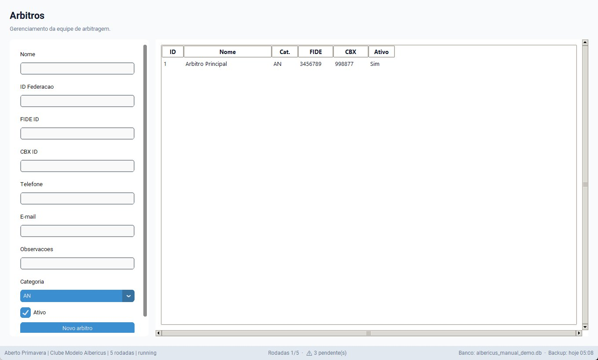

**Principais funcoes:**
- Registra nome, categoria, ID de federacao, FIDE ID, CBX ID, telefone e e-mail.
- Marca arbitro como ativo ou inativo.
- Lista todos os arbitros para selecao e edicao.
- Permite manter observacoes administrativas.

**Fluxo recomendado:**
1. Cadastre os arbitros uma vez.
2. Mantenha IDs oficiais atualizados.
3. Associe arbitros ao torneio nas configuracoes do torneio quando necessario.

### Inventario

**Caminho:** Gestao > Inventario

Controle de material fisico do clube: relogios, pecas, tabuleiros, livros e itens diversos.

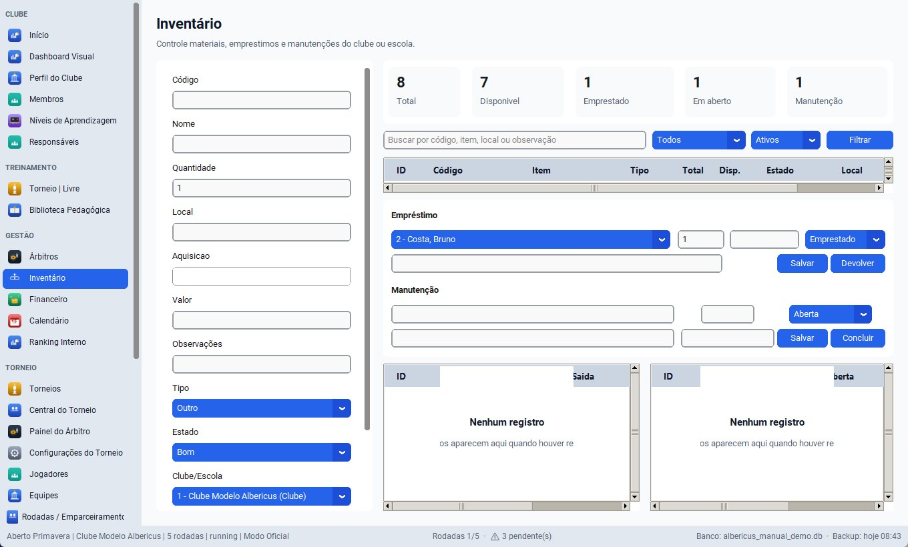

**Principais funcoes:**
- Cadastra item, codigo, tipo, quantidade, estado, local de armazenamento e valor.
- Registra emprestimos por membro, quantidade, data, vencimento e devolucao.
- Registra manutencoes com status, custo, fornecedor e observacoes.
- Resume itens disponiveis, emprestados, atrasados e em manutencao.

**Fluxo recomendado:**
1. Cadastre o estoque.
2. Registre emprestimos quando o material sair.
3. Feche devolucoes e manutencoes para manter saldo correto.

### Financeiro

**Caminho:** Gestao > Financeiro

Controle de planos, mensalidades, pagamentos, lancamentos e patrocinadores.

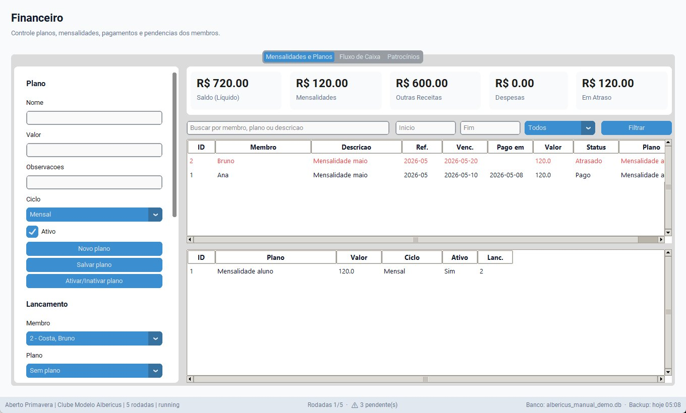

**Principais funcoes:**
- Cria planos de cobranca com valor, ciclo e status.
- Lanca pagamentos por membro, plano, referencia, vencimento e metodo.
- Classifica pagamentos como pago, pendente ou atrasado.
- Mostra resumo de recebido, pendente, atrasado e fluxo financeiro.

**Fluxo recomendado:**
1. Crie os planos.
2. Lance mensalidades ou pagamentos avulsos.
3. Use filtros para cobrar pendencias.
4. Gere DRE em Ferramentas quando precisar consolidar.

### Calendario

**Caminho:** Gestao > Calendario

Agenda de eventos do clube, com possibilidade de vincular torneios.

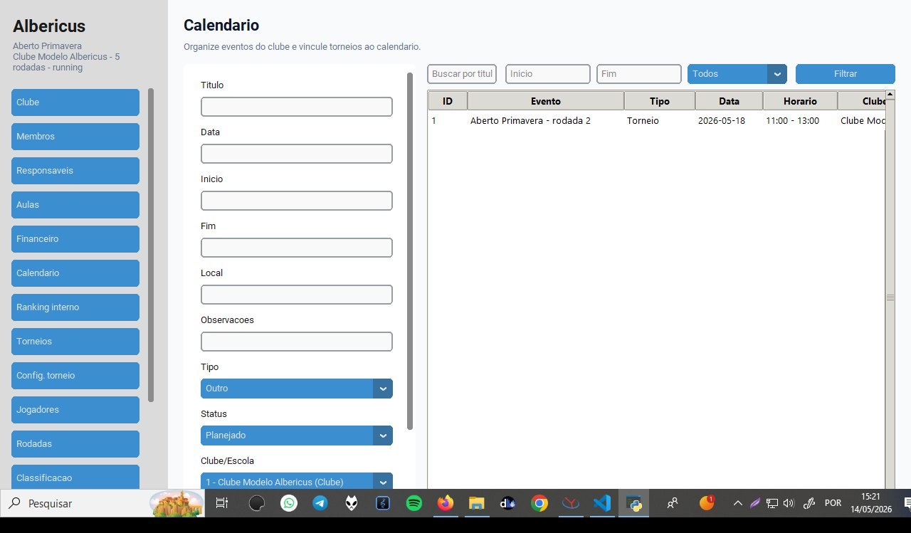

**Principais funcoes:**
- Registra titulo, tipo, data, horario, local, status, clube e torneio vinculado.
- Filtra eventos por texto, periodo e status.
- Permite acompanhar eventos planejados, confirmados, concluidos ou cancelados.
- Alimenta o dashboard visual e relatorios administrativos.

**Fluxo recomendado:**
1. Cadastre eventos futuros.
2. Vincule torneios quando houver.
3. Atualize status conforme a execucao.

### Ranking Interno

**Caminho:** Gestao > Ranking Interno

Rating interno dos membros, calculado a partir dos resultados registrados.

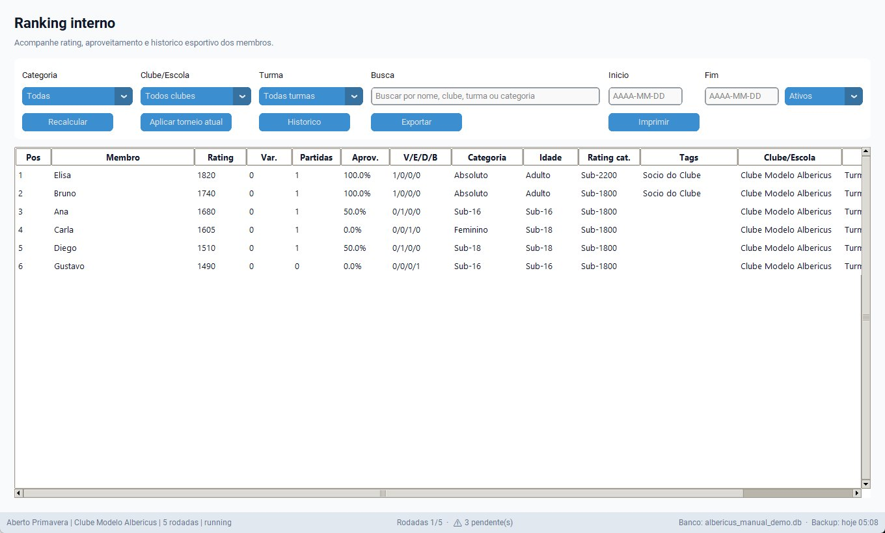

**Principais funcoes:**
- Mostra rating, variacao, partidas, aproveitamento, resultado acumulado e ultima performance.
- Filtra por categoria, status e busca textual.
- Aplica resultados do torneio atual ao rating interno.
- Exporta a tabela de ranking.

**Fluxo recomendado:**
1. Feche rodadas do torneio.
2. Revise a classificacao.
3. Aplique o torneio atual ao ranking interno.
4. Exporte a tabela para divulgacao.

**Cuidados:**
- Convidados externos nao entram como membros no ranking interno.

### Torneios

**Caminho:** Torneio > Torneios

Cria, importa, seleciona, duplica, divide e exclui torneios.

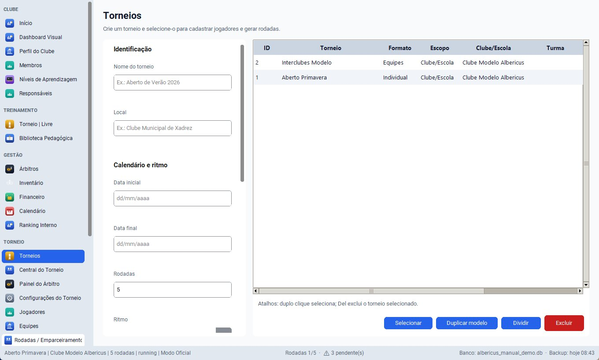

**Principais funcoes:**
- Cria torneio individual ou por equipes.
- Define escopo avulso, clube/escola ou turma.
- Importa TRF do Swiss-Manager.
- Seleciona o torneio ativo para as demais telas.

**Fluxo recomendado:**
1. Preencha nome, local, datas, rodadas, ritmo e bye.
2. Escolha escopo e formato.
3. Crie ou importe.
4. Selecione o torneio antes de usar jogadores e rodadas.

**Cuidados:**
- Sem torneio selecionado, telas como Jogadores, Rodadas, Classificacao, Exportar e Diplomas ficam bloqueadas.

### Central do Torneio

**Caminho:** Torneio > Central do Torneio

Resumo do torneio selecionado e porta de entrada para as abas de operacao.

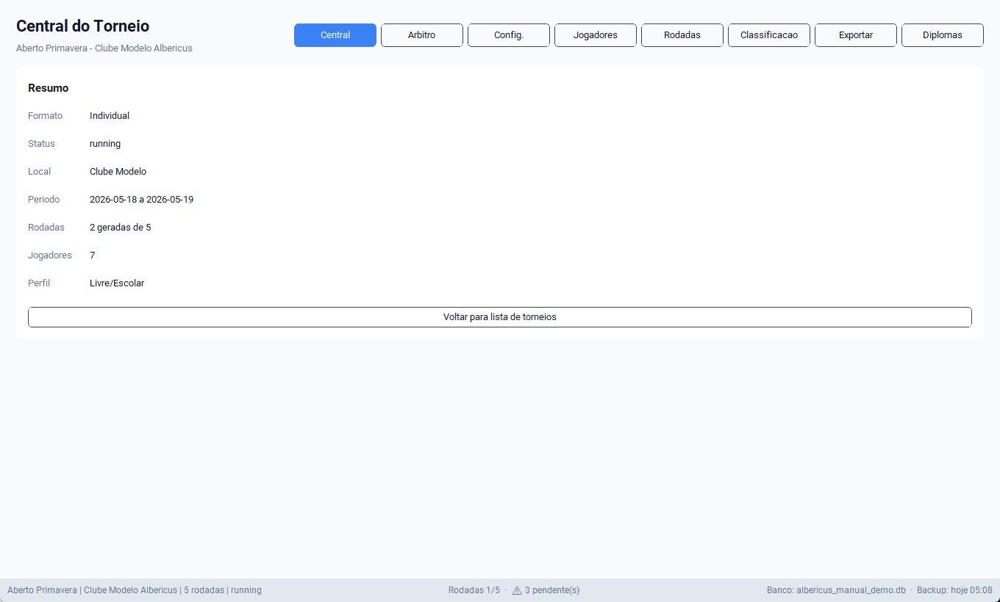

**Principais funcoes:**
- Mostra formato, status, local, periodo, rodadas geradas, jogadores e perfil.
- Exibe navegacao interna: Central, Arbitro, Config., Jogadores, Rodadas, Classificacao, Exportar e Diplomas.
- Mostra Equipes quando o torneio esta no formato por equipes.
- Permite voltar para a lista de torneios.

**Fluxo recomendado:**
1. Selecione o torneio.
2. Revise o resumo.
3. Use a navegacao da propria tela para operar o evento.

### Painel do Arbitro

**Caminho:** Torneio > Painel do Arbitro

Painel operacional para acompanhar pendencias, rodadas, mesas, alertas e acoes criticas da arbitragem.

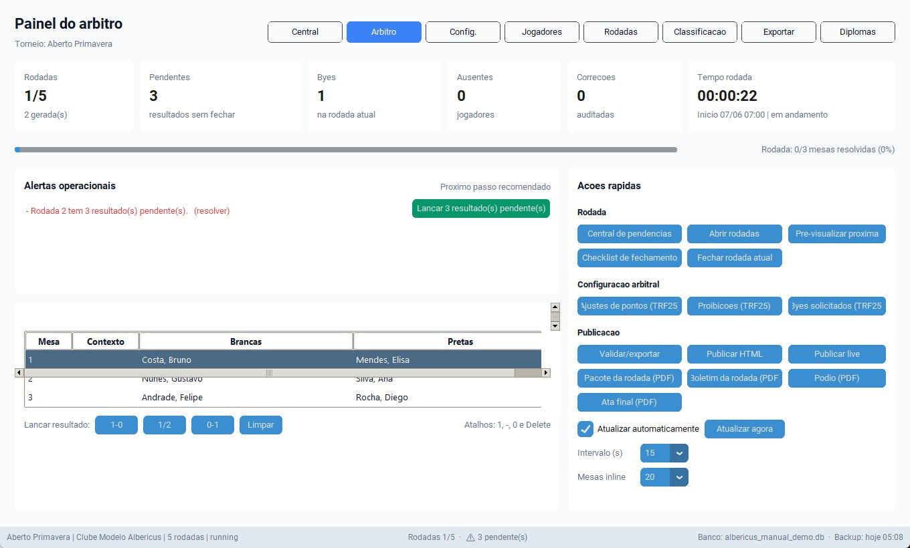

**Principais funcoes:**
- Mostra metricas de rodadas, resultados pendentes, jogadores ativos e pendencias.
- Lista mesas pendentes com busca por mesa ou jogador.
- Oferece atalhos para Central de pendencias, Ajustes de pontos, Proibicoes e Byes solicitados.
- Permite abrir lancamento de resultados e fechar rodada quando permitido.

**Fluxo recomendado:**
1. Abra durante a rodada.
2. Use a busca para localizar mesa.
3. Resolva pendencias antes do fechamento.
4. Atualize a tela periodicamente ou use auto-refresh.

### Central de Pendencias da Arbitragem

**Caminho:** Painel do Arbitro > Central de Pendencias

Lista alertas tecnicos que podem exigir acao do arbitro antes de gerar ou fechar rodadas.

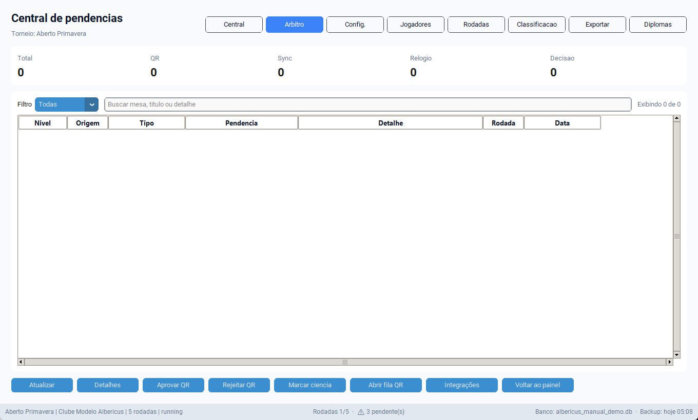

**Principais funcoes:**
- Agrupa pendencias bloqueantes, avisos, QR e conflitos.
- Filtra por tipo de pendencia e busca textual.
- Mostra detalhes tecnicos por duplo clique ou botao Detalhes.
- Permite aprovar/rejeitar QR e marcar ciencia de um alerta.

**Fluxo recomendado:**
1. Filtre pelas pendencias bloqueantes.
2. Abra detalhes.
3. Aplique correcao no modulo indicado.
4. Marque ciencia apenas quando a ocorrencia for aceitavel.

### Ajustes de Pontos

**Caminho:** Painel do Arbitro > Ajustes de pontos (TRF25)

Registra bonificacoes ou penalidades manuais que devem entrar nos calculos e exportacoes.

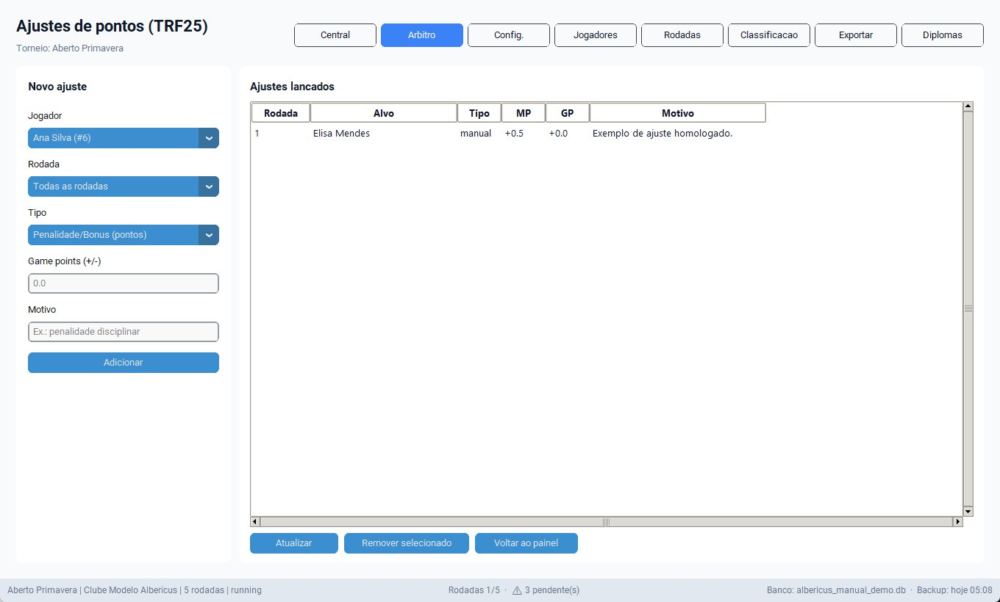

**Principais funcoes:**
- Seleciona jogador ou equipe conforme o formato do torneio.
- Define rodada, tipo AAT, pontos de match, pontos de jogo e justificativa.
- Lista ajustes ja cadastrados.
- Remove ajuste selecionado quando necessario.

**Fluxo recomendado:**
1. Escolha o participante.
2. Informe rodada e pontos.
3. Descreva a justificativa.
4. Revise classificacao e exportacao depois do ajuste.

### Proibicoes de Emparceiramento

**Caminho:** Painel do Arbitro > Proibicoes (TRF25)

Impede que determinados jogadores ou equipes sejam pareados em uma janela de rodadas.

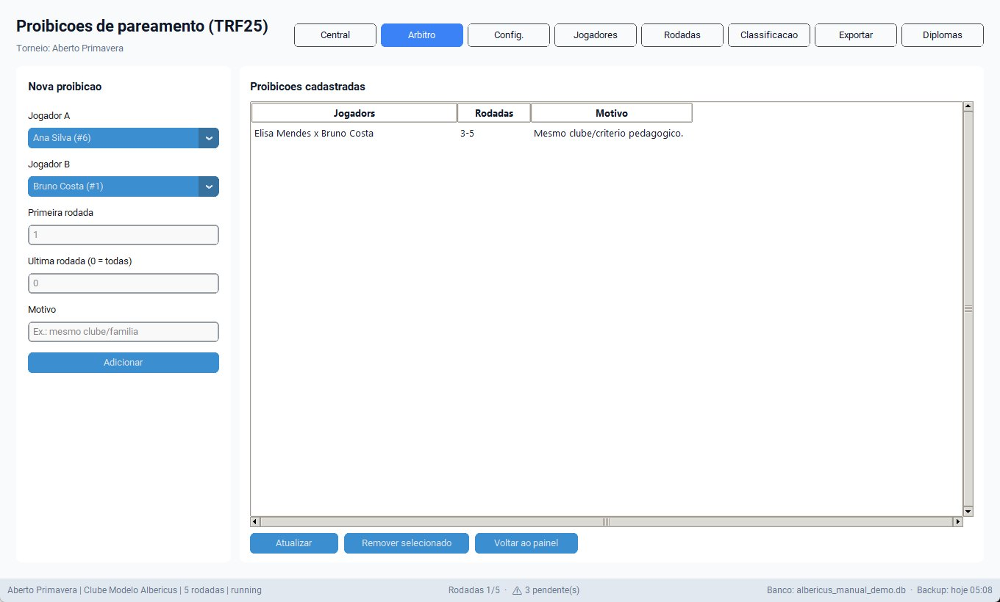

**Principais funcoes:**
- Seleciona dois participantes.
- Define primeira e ultima rodada de validade.
- Registra motivo da proibicao.
- Remove proibicoes quando deixarem de valer.

**Fluxo recomendado:**
1. Cadastre a proibicao antes de gerar a rodada afetada.
2. Use ultima rodada vazia/zero para manter aberta.
3. Confira a pre-visualizacao da rodada depois.

### Byes Solicitados

**Caminho:** Painel do Arbitro > Byes solicitados (TRF25)

Registra pedidos de bye para que o motor de emparceiramento trate ausencias autorizadas.

**Principais funcoes:**
- Seleciona jogador, rodada e tipo de bye.
- Aceita tipos F, H e Z conforme configuracao operacional.
- Mantem justificativa textual.
- Remove solicitacoes incorretas.

**Fluxo recomendado:**
1. Registre o bye antes de gerar a rodada.
2. Confirme se o jogador permanece com status adequado.
3. Gere a rodada e revise a mesa de bye.

### Configuracao do Torneio

**Caminho:** Torneio > Config. Torneio

Dados oficiais, agenda, regras, flags, perfis, criterios e parametros normativos do torneio.

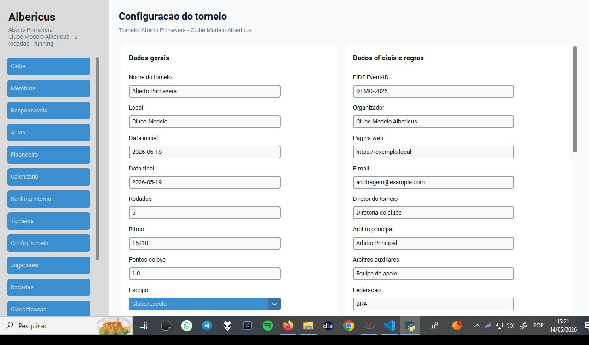

**Principais funcoes:**
- Edita dados gerais: nome, escopo, local, datas, rodadas, ritmo e bye.
- Mantem dados oficiais: FIDE Event-ID, organizador, pagina, diretores, arbitros, federacao, categorias e premios.
- Configura sistema de emparceiramento, aceleracao, criterios de desempate e perfil do torneio.
- Controla flags como inscricao publica, ocultar classificacao, desativar bye e mudancas perigosas.

**Fluxo recomendado:**
1. Revise dados oficiais antes da primeira rodada.
2. Defina agenda de rodadas.
3. Ajuste regras e criterios.
4. Evite alterar parametros sensiveis depois de rodadas fechadas.

### Jogadores

**Caminho:** Torneio > Jogadores

Inscricao e manutencao dos participantes do torneio selecionado.

**Principais funcoes:**
- Adiciona jogador manualmente com nome, rating, categoria, clube e IDs oficiais.
- Inscreve membros ativos do clube/turma quando o escopo permite.
- Importa CSV, TRF/Chess-Results e dados de formulario quando configurado.
- Atualiza dados oficiais por FIDE/CBX/LBX e controla status do jogador.

**Fluxo recomendado:**
1. Inscreva os participantes.
2. Atualize dados oficiais.
3. Revise status ativo, ausente, desistente ou nao emparceirado.
4. So gere rodada quando a lista estiver correta.

**Cuidados:**
- Apenas jogadores ativos entram normalmente nas proximas rodadas.

### Equipes

**Caminho:** Torneio > Equipes

Cadastro de equipes, escalação de jogadores e tabuleiros para torneios por equipes.

**Principais funcoes:**
- Cria equipe com nome, clube/cidade, capitao, observacoes e status.
- Seleciona jogador inscrito e atribui tabuleiro e funcao.
- Lista equipes e jogadores escalados.
- Bloqueia exclusao quando a equipe ja apareceu em rodadas, preservando historico.

**Fluxo recomendado:**
1. Crie o torneio no formato Equipes.
2. Inscreva jogadores.
3. Crie equipes.
4. Associe jogadores a tabuleiros antes de gerar a rodada.

**Cuidados:**
- Em torneio individual, esta tela informa que o formato precisa ser alterado para Equipes.

### Rodadas e Resultados

**Caminho:** Torneio > Rodadas

Gera emparceiramentos, lanca resultados, exporta listas de mesas e fecha rodadas.

**Principais funcoes:**
- Gera proxima rodada e pre-visualiza antes de gravar.
- Lanca resultado da mesa selecionada.
- Troca cores ou jogador antes do fechamento quando permitido.
- Exporta/imprime rodada, sumulas, cartoes de mesa e QR de resultado.

**Fluxo recomendado:**
1. Gere a rodada.
2. Imprima ou publique as mesas.
3. Lance todos os resultados.
4. Feche a rodada somente depois de conferir pendencias.

**Cuidados:**
- Rodada fechada fica protegida; alteracoes posteriores exigem permissao/configuracao especifica.

### Classificacao

**Caminho:** Torneio > Classificacao

Tabela de pontuacao e desempates do torneio selecionado.

**Principais funcoes:**
- Recalcula a classificacao a qualquer momento.
- Filtra por categoria.
- Mostra pontos, Buchholz, Buchholz mediano, Sonneborn-Berger, vitorias, performance, rating e clube.
- Permite abrir detalhes de desempate e atualizar ranking interno.

**Fluxo recomendado:**
1. Recalcule apos salvar/fechar rodadas.
2. Filtre categorias para premiacao.
3. Use os detalhes para explicar desempates.
4. Exporte pelo modulo Exportar.

### Diplomas

**Caminho:** Torneio > Diplomas

Gera certificados e diplomas em PDF para participantes e premiados.

**Principais funcoes:**
- Seleciona ou cria modelo de diploma.
- Configura tipo, orientacao, logos, fundo, cores, fontes, textos e assinaturas.
- Escolhe destinatarios: todos, Top N geral, Top N por categoria ou selecionados.
- Gera PDF e registra emissoes com codigo de verificacao.

**Fluxo recomendado:**
1. Revise a classificacao.
2. Escolha modelo e destinatarios.
3. Confira a contagem/preview.
4. Gere o PDF final.

### Exportar

**Caminho:** Ferramentas > Exportar

Gera arquivos do torneio e publicacoes externas.

**Principais funcoes:**
- Exporta completo, classificacao, rodada especifica, todas as rodadas, jogadores e site HTML.
- Gera CSV, XLSX e PDF conforme o tipo escolhido.
- Valida TRF FIDE antes de enviar a federações ou Chess-Results.
- Gera lote de arquivos e pacote web quando necessario.

**Fluxo recomendado:**
1. Escolha o tipo de exportacao.
2. Escolha formato e rodada quando aplicavel.
3. Valide TRF quando for arquivo oficial.
4. Salve na pasta de exportacao.

### Relatorios Administrativos

**Caminho:** Ferramentas > Relatorios Administrativos

Relatorios gerenciais do clube, membros, aulas, eventos, financeiro e ranking.

**Principais funcoes:**
- Gera relatorio geral do clube.
- Gera relatorio individual de membro.
- Gera relatorios por periodo: torneios, presencas, financeiro e eventos.
- Gera pacote administrativo consolidado.

**Fluxo recomendado:**
1. Escolha o tipo de relatorio.
2. Informe periodo ou membro quando exigido.
3. Escolha CSV, XLSX ou PDF.
4. Clique em Gerar relatorio.

### DRE Financeiro

**Caminho:** Ferramentas > DRE Financeiro

Demonstrativo financeiro por periodo, com receitas, despesas e resultado liquido.

**Principais funcoes:**
- Calcula receitas por categoria.
- Calcula despesas por categoria.
- Mostra resultado liquido do periodo.
- Gera PDF do DRE.

**Fluxo recomendado:**
1. Informe data inicial e final.
2. Clique em Calcular.
3. Revise categorias.
4. Gere PDF do DRE quando precisar prestar contas.

### Comunicacao

**Caminho:** Ferramentas > Comunicacao

Envio de comunicados por e-mail, disparo em massa, WhatsApp e configuracao SMTP.

**Abas ou areas internas:**
- E-mail
- Disparo em massa
- WhatsApp
- Config. SMTP

**Principais funcoes:**
- Envia e-mail individual por destinatario, assunto e mensagem.
- Faz disparo em massa para todos ativos, por turma ou por tipo de membro.
- Agenda e cancela mensagens pendentes.
- Abre mensagem no WhatsApp e salva configuracao SMTP.

**Fluxo recomendado:**
1. Configure SMTP.
2. Escolha e-mail individual ou disparo em massa.
3. Defina publico e mensagem.
4. Envie agora ou informe data/hora para agendar.

### Integracoes Operacionais

**Caminho:** Ferramentas > Integracoes Operacionais

Monitoramento de sincronizacao, dispositivos, eventos de relogio/ausencia e publicacao de album por FTP.

**Abas ou areas internas:**
- Sincronizacao
- Dispositivos
- Relogio/Ausencia
- Album/FTP

**Principais funcoes:**
- Configura URL de sincronizacao e chaves de habilitacao.
- Lista fila de eventos pendentes e detalhes tecnicos.
- Autoriza ou revoga dispositivos.
- Registra eventos manuais de relogio/ausencia e configura FTP para album de fotos.

**Fluxo recomendado:**
1. Configure servidor e flags.
2. Autorize dispositivos se houver operacao distribuida.
3. Monitore pendencias.
4. Use eventos de relogio para auditoria operacional.

### Biblioteca Pedagogica

**Caminho:** Ctrl+K > Biblioteca Pedagogica

Acervo pedagogico para exercicios, textos, apostilas, importacao PGN e historico de envio.

**Abas ou areas internas:**
- Acervo
- Apostilas
- Importador PGN
- Historico de Envio

**Principais funcoes:**
- Cadastra exercicios e textos com FEN/PGN, tema, nivel, solucao, tags e autor.
- Cria apostilas e exporta PDF do aluno ou professor.
- Extrai exercicios de PGN marcado com lances fortes.
- Registra envio manual para turmas e alerta repeticoes recentes.

**Fluxo recomendado:**
1. Cadastre itens no acervo.
2. Monte apostilas.
3. Exporte para aluno/professor.
4. Registre envios para controlar repeticao.

### Configuracoes do Aplicativo

**Caminho:** Configuracoes > Config. App

Preferencias locais, pastas, backup, seguranca, usuarios e bases oficiais.

**Abas ou areas internas:**
- Aparencia
- Pastas e backup
- Seguranca e dados

**Principais funcoes:**
- Ajusta aparencia, cor de destaque e escala da interface.
- Define pastas de exportacao, backups e nuvem.
- Gerencia usuarios do sistema e permissoes por perfil.
- Baixa lista FIDE, importa lista CBX e cria/restaura backups.

**Fluxo recomendado:**
1. Configure pastas antes de operar torneios.
2. Crie backup antes de mudancas importantes.
3. Revise retencao.
4. Use restauracao apenas com backup conferido.

### Auditoria Completa

**Caminho:** Configuracoes > Auditoria Completa

Consulta de logs tecnicos e administrativos do sistema.

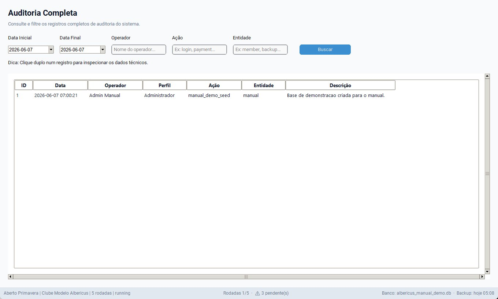

**Principais funcoes:**
- Filtra por data inicial, data final, operador, acao e entidade.
- Lista data, operador, perfil, acao, entidade e descricao.
- Abre metadados JSON por duplo clique.
- Ajuda a investigar backups, restauracoes, logins, permissoes e operacoes sensiveis.

**Fluxo recomendado:**
1. Defina filtros.
2. Clique em Buscar.
3. Abra metadados quando precisar de detalhe tecnico.
4. Use como trilha de auditoria e suporte.

### Palette de Comandos

**Caminho:** Ajuda > Buscar acao...

Busca rapida de telas e comandos por teclado.

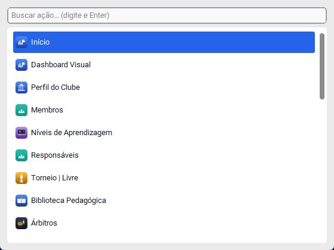

**Principais funcoes:**
- Abre com Ctrl+K.
- Filtra acoes por nome e palavras-chave.
- Executa a acao selecionada com Enter.
- Inclui atalhos que nao aparecem no menu principal, como Biblioteca Pedagogica.

**Fluxo recomendado:**
1. Pressione Ctrl+K.
2. Digite parte do nome da tela.
3. Use setas para escolher.
4. Pressione Enter.

## Regras importantes

- Fechar rodada exige resultados completos em todas as mesas validas.
- Rodada fechada preserva historico; alteracoes posteriores exigem permissao e configuracao adequada.
- Jogador ausente, desistente ou nao emparceirado permanece no historico, mas nao deve entrar normalmente em novas rodadas.
- Antes de exportar TRF ou relatorio oficial, revise IDs, federacao, nascimento, rating, arbitro chefe, ritmo e datas.
- Backups devem ser feitos antes de fechar rodadas criticas, restaurar dados ou importar listas grandes.
- Para torneios por equipes, cadastre equipes e escalações antes de gerar rodadas.

## Problemas comuns

| Situacao | O que verificar |
|---|---|
| Nao consigo gerar rodada | Verifique se ha jogadores ativos suficientes e se a rodada anterior foi fechada ou excluida. |
| A tela de torneio parece vazia | Selecione um torneio em **Torneio > Torneios**. |
| Classificacao nao atualiza | Recalcule a classificacao e confira se resultados foram salvos. |
| Exportacao falha | Verifique permissao da pasta e se o arquivo destino nao esta aberto em outro programa. |
| Login ou permissao bloqueia uma acao | Revise usuarios/perfis em **Configuracoes > Config. App**. |
| Preciso voltar dados | Use **Criar backup agora** antes e restaure apenas backups conferidos. |
